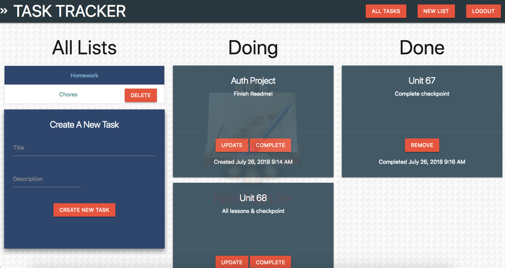

# TASK MANAGER
------------------------------

### ABOUT THIS PROJECT

This front-end project was based off of a pre-made server and database provided by Galvanize. A 2-person team was tasked with creating and implementing all necessary front-end code for the pre-written server/database to complete this the project. The code includes axios calls, user authentication and DOM manipulation, as well as all front-end design. The result of this collaboration is a full-stack Task Manager, which is available locally on your machine or deployed online through Heroku & Surge. 

The Task Manager app allows users to create a unique account, and from there they will have access to their Task Manager. Each unique Task Manager is comprised of a collection of Lists and options, and each List contains it's own collection of Tasks.

### OPTIONS AVAILABLE TO THE USER

    -Signup { Name, Last Name, Email, Password, Password-Duplicate }
    -Login { Email, Password }
    -Create List { Title }
    -Delete List | also deletes all Tasks associated with this List
    -For each List :  
       -Create Task { Title, Description } | creates a Task in the Doing column
       -Complete Task | moves the Task from the Doing column into the Done column
       -Update Task { Title, Description }
       -Delete Task | deletes Task    
    - Logout  

### FEATURES

-Token Authorization ensures that only one user has access to their unique Task Manager account
-Users are able to create and delete Lists as well as create, complete, update and delete Tasks for each List
-Input validation will alert a user if required field is left blank
-Fade in/out on each input element is highly visually appealing
-Clicking on any button creates a very satisfying ripple-effect of color on that button
-Did you see the way that the title 'Task Manager' slides in to the left upon render?

### TO INSTALL TASK MANAGER

    -fork and clone this frontend repository onto your local machine
    -run 'npm install' in your terminal
    -run 'npm run dev'
    -the prevous step will open the frontend program in your browser using live-server, connected to the backend deployed with Heroku

### TO USE TASK MANAGER ONLINE

    -visit <a href="task-pro.surge.sh">Task Manager Online!</a>

### BUILT WITH

    -Javascript, HTML & CSS
    -Materialize
    -Axios
    -Browserify & Watchify
    -Live-server 
    -AnimeJS
    -Moment

### DEVELOPERS

    -For more information, pleasee contact this project's developers, Dillon Easter or Jewell White at:   
        johndilloneaster@gmail.com or jewellsmailbox@gmail.com 